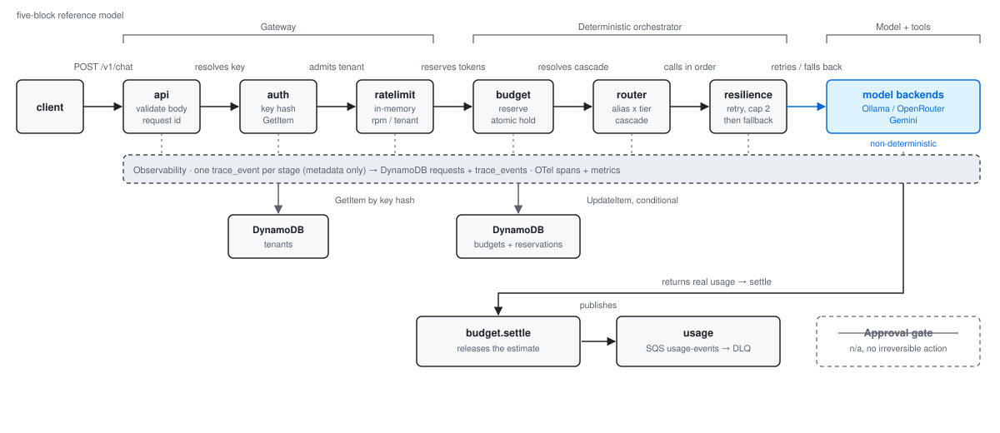
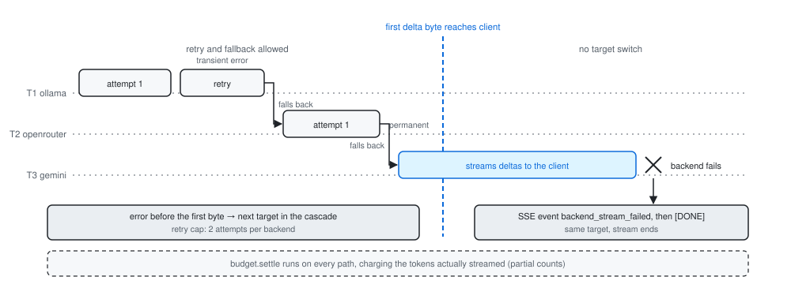
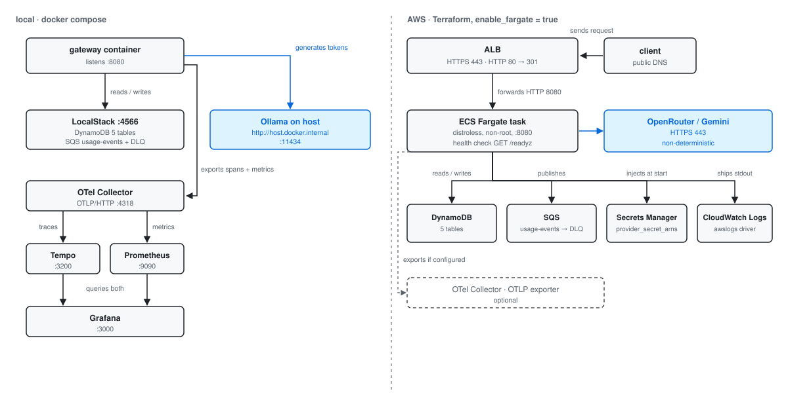

# ai-gateway

An OpenAI-compatible LLM gateway in Go: multi-tenant auth, per-tenant rate limits and token budgets, retry/fallback across Ollama, OpenRouter and Gemini, and an end-to-end audit trail per request.

[](https://github.com/Mouraovicente/ai-gateway/actions/workflows/ci.yml)


## What it is

One HTTP endpoint (`POST /v1/chat/completions`, OpenAI-shaped) in front of several LLM providers. It resolves a tenant from an API key, enforces that tenant's request rate and monthly token budget, picks an ordered backend cascade from `alias + tier`, retries and falls back across providers (including mid-stream, with a first-byte rule), settles the budget with the real token usage, publishes a usage event, and records one trace event per pipeline stage. The control path is entirely deterministic — no LLM decides routing, limits or budget. Design spec, including the mini-ADRs behind those choices: [`docs/superpowers/specs/2026-09-19-ai-gateway-design.md`](docs/superpowers/specs/2026-09-19-ai-gateway-design.md).

<picture>
  <source media="(prefers-color-scheme: dark)" srcset="docs/diagrams/request-pipeline-dark.svg">
  
</picture>

*The full request pipeline, with the stores each stage touches and the five-block reference model it maps onto.*

## Quickstart in 60 seconds

Needs Go 1.27 and [Ollama](https://ollama.com) with `qwen2.5-coder:1.5b` pulled. No AWS, no Docker: `STORE_BACKEND=memory` swaps all four storage ports (tenants, budgets, traces, usage) for in-process implementations and loads the fake dev tenants from `config/tenants.dev.yaml`.

```bash
ollama pull qwen2.5-coder:1.5b
STORE_BACKEND=memory go run ./cmd/gateway   # listens on :8080
```

```bash
curl http://localhost:8080/v1/chat/completions \
  -H "Authorization: Bearer dev-free-key" \
  -H "Content-Type: application/json" \
  -d '{"model":"nuva/fast","messages":[{"role":"user","content":"hi"}]}'
```

```bash
curl -N http://localhost:8080/v1/chat/completions \
  -H "Authorization: Bearer dev-standard-key" \
  -H "Content-Type: application/json" \
  -d '{"model":"nuva/fast","messages":[{"role":"user","content":"hi"}],"stream":true}'
```

`dev-free-key` / `dev-standard-key` / `dev-premium-key` (one per tier) and `bench-key` are deliberately public fakes, committed in `config/tenants.dev.yaml` for local use only. Memory mode logs a warning on boot and is never for production.

<details>
<summary><b>Full local stack</b> (LocalStack + Terraform + DynamoDB/SQS + Grafana)</summary>

Adds Docker Compose, and `tflocal`/`awslocal` (`pip install terraform-local awscli-local`) — the `infra/` Terraform can also be applied with plain `terraform` pointed at LocalStack's endpoint.

```bash
# 1. Local AWS (DynamoDB + SQS)
docker compose up -d localstack

# 2. Provision tables + queues
cd infra && tflocal init && tflocal apply -auto-approve && cd ..

# 3. Seed the dev tenants into DynamoDB (same fake keys as memory mode)
go run ./scripts/seed_tenants.go

# 4. Environment (defaults shown; override only what you need)
export AWS_ENDPOINT_URL=http://localhost:4566
export AWS_ACCESS_KEY_ID=test        # LocalStack accepts any value
export AWS_SECRET_ACCESS_KEY=test
export AWS_REGION=us-east-1
export ROUTING_CONFIG=config/routing.yaml      # default
export OLLAMA_BASE_URL=http://localhost:11434  # default from routing.yaml
export GATEWAY_ADDR=:8080                      # default
# export OPENROUTER_API_KEY=...   # only to exercise the openrouter backend
# export GEMINI_API_KEY=...       # only to exercise the gemini backend
# export OTEL_EXPORTER_OTLP_ENDPOINT=http://localhost:4318  # OTLP/HTTP, not gRPC 4317
# export TRUST_PROXY=true         # only behind a proxy that sets X-Forwarded-For

go run ./cmd/gateway
```

Observability stack (optional — the gateway runs fine without it):

```bash
docker compose up -d otel-collector tempo prometheus grafana
```

Grafana on `http://localhost:3000` with the "ai-gateway" dashboard provisioned from `deploy/grafana/dashboards/gateway.json`; Tempo `:3200`, Prometheus `:9090`, OTLP/HTTP `:4318`. Every compose port is bound to `127.0.0.1` on purpose — see [`SECURITY.md`](SECURITY.md).

Other env vars read by `cmd/gateway/main.go`: `STORE_BACKEND`, `DEV_TENANTS_CONFIG`, `TENANTS_TABLE`, `BUDGETS_TABLE`, `RESERVATIONS_TABLE`, `REQUESTS_TABLE`, `TRACE_EVENTS_TABLE`, `USAGE_QUEUE_NAME`, `TRACE_QUEUE_SIZE`, `USAGE_QUEUE_SIZE`, `IP_AUTH_FAILURES_PER_MINUTE`.

</details>

## How a request flows

1. **api** — pre-auth per-IP limiter, `Authorization: Bearer` parsed, server-generated `X-Request-Id`, body validated (1 MiB cap, ≤ 64 messages, ≤ 256 KiB of prompt bytes, roles limited to `system`/`user`/`assistant`, `max_tokens` 1..32768, trailing JSON rejected) — `internal/api/pipeline.go`.
2. **auth** — SHA-256 of the key is the `tenants` partition key; resolves `{id, tier, rpm_limit, monthly_token_budget}` — `internal/auth`.
3. **ratelimit** — per-tenant token bucket; 429 plus `Retry-After` when exhausted — `internal/ratelimit`.
4. **budget.reserve** — pessimistic token estimate held with one atomic conditional `UpdateItem`; 402 if it would break the monthly budget — `internal/budget`.
5. **router** — `alias + tier` resolves to an ordered list of targets from `config/routing.yaml` — `internal/router`.
6. **resilience** — walks the cascade: up to 2 attempts per backend with exponential backoff and jitter, then the next target; `Transient` retries, `Permanent` does not — `internal/resilience`.
7. **backend** — provider adapter (`ollama`, `openrouter`, `gemini`), buffered or SSE — `internal/backend/*`.
8. **budget.settle** — adjusts `used` by the real token delta reported by the provider, clamped to a sane range; runs on every path, including partial streams.
9. **usage + trace** — one `usage_event` v1 onto a bounded queue to SQS, one `trace_event` per stage onto another; neither is on the request's critical path.

Storage: DynamoDB `tenants` (pk `api_key_hash`), `budgets` (pk `tenant_id`, sk `period`), `reservations` (TTL for orphans), `requests` and `trace_events` (pk `request_id`, sk `seq`); SQS `usage-events` with a DLQ.

<picture>
  <source media="(prefers-color-scheme: dark)" srcset="docs/diagrams/streaming-fallback-dark.svg">
  
</picture>

*Streaming fallback: the cascade may retry and switch targets only until the first delta byte reaches the client; after that a backend failure ends the stream with a `backend_stream_failed` SSE event instead of splicing a second model's output into the same response.*

## Design rules enforced in code

- **Budget is reserved before the call**, never check-then-act: a single `UpdateItem` with `ConditionExpression: (attribute_not_exists(used) AND :est <= :limit) OR used <= :maxAllowed` — [`internal/budget/budget.go`](internal/budget/budget.go).
- **Streaming fallback stops at the first byte** — `ErrStreamFailedAfterFirstByte`, [`internal/resilience/resilience.go`](internal/resilience/resilience.go).
- **Typed `Transient`/`Permanent` errors drive retry**, never a string match on the provider's message — `BackendError` in [`internal/core`](internal/core), consumed by `internal/resilience`.
- **Provider-reported usage is clamped**: a total outside `[0, 4 × estimate]` falls back to the estimate, so a provider cannot credit or overcharge a tenant's budget — `sanitizeRealTokens` in [`internal/api/pipeline.go`](internal/api/pipeline.go).
- **API keys never appear in URLs** — `Authorization` header only, looked up by hash; provider keys travel in headers and come from the env var *named* by `routing.yaml`, never hardcoded — [`internal/auth`](internal/auth), [`cmd/gateway/main.go`](cmd/gateway/main.go).
- **The logger has a tested forbidden-key list** (`message`, `messages`, `answer`, `trace`, `content`, `payload`, `prompt`, `completion`) dropped by the handler and rejected by every trace store — [`internal/trace/logger.go`](internal/trace/logger.go), `logger_test.go`.
- **The audit trail never blocks a request**: trace writes and usage publishes go to bounded queues that drop-and-count under pressure, and are drained on shutdown — [`internal/trace/async.go`](internal/trace), [`internal/usage`](internal/usage).
- **Two layers of rate limiting**: per-tenant after auth, plus a pre-auth per-IP bucket charged only by auth *failures* (60/min default), so brute force never reaches the tenant store — [`internal/ratelimit`](internal/ratelimit).
- **Timeouts everywhere**: `ReadHeaderTimeout` 10s, `ReadTimeout` 30s, `IdleTimeout` 120s, no global `WriteTimeout` (it would kill SSE) — the slow-client cut is a per-chunk SSE write deadline instead — `cmd/gateway/main.go`, `Pipeline.StreamWriteTimeout`.
- **OpenTelemetry is optional**: without `OTEL_EXPORTER_OTLP_ENDPOINT` the gateway installs no exporter and falls back to OTel's no-ops.

## Performance

Local benchmark, single instance, stub Ollama backend, `hey` as the load generator. Full method, hardware and caveats: [`docs/benchmarks/2026-09-20-local.md`](docs/benchmarks/2026-09-20-local.md).

| Scenario (concurrency 50) | Before | After |
|---|---|---|
| `STORE_BACKEND=memory`, 0 ms backend | n/a (mode did not exist) | **15,153 req/s**, p50 2.6 ms, p99 11.5 ms |
| `STORE_BACKEND=memory`, 200 ms backend | n/a | 248 req/s, p50 201 ms (ceiling is 250) |
| `STORE_BACKEND=memory`, streaming | n/a | 7,509 req/s |
| `STORE_BACKEND=memory`, auth reject (c=100) | n/a | 62,739 req/s |
| LocalStack (DynamoDB + SQS), 0 ms backend | 7.15 req/s, p50 6.92 s | **18.18 req/s**, p50 2.74 s |
| LocalStack, concurrency 200 | collapsed (200/200 timeouts) | 21.34 req/s, no failures |

The before/after gap comes from one change: the request path went from ~11 synchronous store round trips to 2 (auth `GetItem`, budget reserve/settle), with the request row and trace events batched onto a background queue and the usage event onto another.

**What the numbers mean**: with a 200 ms backend the gateway delivers 248 of a theoretical 250 req/s — its own cost is roughly 1 ms per request, so the backend is the only remaining limit. **What they do not mean**: they are not a production capacity figure. Windows dev box, single instance, no `-race` build, a stub instead of a real model, and LocalStack's single-process emulator is what the ~19 req/s mode is actually measuring — real DynamoDB is an order of magnitude faster. Above ~10k req/s the load generator and the OS ephemeral-port range give up before the gateway does.

Reproduce: `bash bench/run.sh memory` and `bash bench/run.sh` ([`bench/run.sh`](bench/run.sh)).

## API

| Endpoint | Auth | Purpose |
|---|---|---|
| `POST /v1/chat/completions` | Bearer key | OpenAI-shaped chat; `stream: true` for SSE; optional `max_tokens` (1..32768) |
| `GET /v1/models` | none | aliases from `config/routing.yaml` only — never the backend inventory |
| `GET /healthz` | none | liveness, static |
| `GET /readyz` | none | store reachable + at least one backend; result cached 5s |
| `GET /stats` | Bearer key | latency/token percentiles from a 5-minute in-memory window, the caller's own tenant plus a tenant-free global `total` |

Errors are `{"error":{"type","message","request_id"}}`:

| Type | Status | When |
|---|---|---|
| `missing_api_key` | 401 | no `Authorization` header |
| `invalid_api_key` | 401 | key resolves to no tenant |
| `rate_limited` | 429 | tenant bucket or pre-auth IP bucket exhausted; `Retry-After` set |
| `budget_exceeded` | 402 | reservation would exceed the monthly budget |
| `unknown_model` | 400 | alias not in `routing.yaml` |
| `tier_forbidden` | 403 | tenant's tier cannot reach that target directly |
| `unknown_provider` | 400 | target names a provider that is not configured |
| `invalid_request` | 400 / 413 | malformed body, empty `messages`/`model`, bad role, bad `max_tokens`; 413 when a size cap is hit |
| `store_unavailable` | 503 | tenant store failed (never reported as an auth failure) |
| `tenant_misconfigured` | 500 | tenant row is incomplete |
| `all_backends_failed` | 502 | whole cascade failed; body carries an `attempts` array |
| `backend_stream_failed` | SSE event | backend failed after the first chunk; sent as an SSE `error` event followed by `data: [DONE]` |

**Request id contract**: `X-Request-Id` is always server-generated, returned on the response header, included in every error body and on every `trace_event`. A client-supplied `X-Request-Id` is never trusted — it is sanitized, bounded to 128 chars, echoed back as `X-Client-Request-Id` and recorded as `client_request_id`.

`usage_event` v1, one per finished or failed request, metadata only — never message content:

```json
{
  "event_version": 1,
  "request_id": "b3f1...",
  "tenant_id": "tenant-standard",
  "tier": "standard",
  "alias": "nuva/fast",
  "provider": "ollama",
  "model": "qwen2.5-coder:1.5b",
  "prompt_tokens": 12,
  "completion_tokens": 48,
  "ttft_ms": 210,
  "latency_ms": 890,
  "status": "ok",
  "error_class": "",
  "attempts": [{"provider": "ollama", "model": "qwen2.5-coder:1.5b", "status": "ok", "latency_ms": 890}],
  "ts": "2026-09-19T20:00:00Z"
}
```

## Observability

Three layers, all keyed by the same request id.

- **Trace events** (`internal/trace`) — persisted to DynamoDB `trace_events` with `seq`, in pipeline order: `auth`, `ratelimit`, `budget_reserve`, `route`, `backend_attempt`, `backend_result`, `budget_settle`, `usage_publish`, plus `error`. Payloads are metadata only, capped at 64 KiB, and forbidden keys are rejected by the store as well as by the logger.
- **OTel spans** — root `POST /v1/chat/completions` with children `auth`, `budget.reserve`, `route`, `backend.call`, `budget.settle`, `usage.publish`; tenant id and tier as attributes.
- **OTel metrics** — `gateway_requests_total{route,model,tenant,status}`, `gateway_latency_ms`, `gateway_tokens_total{...,kind=prompt|completion}`, `gateway_ttft_ms`, plus queue health: `gateway_trace_queue_depth`, `gateway_usage_queue_depth`, `gateway_trace_dropped_total`, `gateway_usage_dropped_total`.

Exported via OTLP/HTTP to the Collector, which fans out to Tempo (traces) and Prometheus (metrics); Grafana provisions the "ai-gateway" dashboard from `deploy/grafana/dashboards/gateway.json`. `GET /stats` gives the same latency/token picture with no collector at all.

## Deployment

<picture>
  <source media="(prefers-color-scheme: dark)" srcset="docs/diagrams/deployment-dark.svg">
  
</picture>

*The two deployment shapes: docker compose with LocalStack and the observability stack locally, and the Terraform ECS Fargate topology on AWS.*

Fargate sits behind the `enable_fargate` Terraform flag, off by default and off in CI — LocalStack Community does not emulate ECS/ALB well enough to validate it, so the real `apply` is manual against a real account. The ALB always terminates TLS: HTTPS:443 to the service, HTTP:80 redirecting 301, and `acm_certificate_arn` (same region as the ALB) is required whenever `enable_fargate=true`. Provider secrets are passed by ARN via `provider_secret_arns` and resolved from Secrets Manager, never as plain task-definition environment variables. The module also creates both security groups: internet → ALB on 443/80, ALB SG → task on 8080 only.

Cost warning: one Fargate task (512 CPU / 1024 MB) plus an ALB running 24/7 costs on the order of tens of USD per month even with no traffic. Full walkthrough (in Portuguese): [`docs/deploy-fargate.md`](docs/deploy-fargate.md).

## Security

Keys are stored as SHA-256 and used as the partition key, so lookup is hit/miss-symmetric with no comparison in Go. Every trust boundary is treated as hostile: the client (body caps, per-IP pre-auth limiter, SSE write deadline), the provider (bounded reads — 8 MiB per buffered body, 1 MiB per stream line — and clamped usage counts), and the AWS store (failures surface as 503, never as an auth error). No prompt or completion content ever reaches a log, a span or a trace row. The image is distroless and non-root; CI runs with `permissions: contents: read` and every action pinned to a commit SHA.

Known gaps, stated rather than omitted: **no pepper on the key hash** (it must stay deterministic as a partition key; the fix is HMAC-SHA256 with a Secrets Manager pepper plus a re-hash migration), **no revocation or expiry field** (revoking today means deleting the row), **rate limit and budget are per instance**, the **502 body exposes cascade topology** to an authenticated caller by design, and **one unreachable transitive advisory** (GO-2026-6443 in `google.golang.org/grpc`, via the OTel exporter; the gateway exports over HTTP and runs no gRPC server).

Full model: [`docs/security.md`](docs/security.md). Reporting: [`SECURITY.md`](SECURITY.md).

## Testing and CI

| | Command | Needs |
|---|---|---|
| Unit | `go test -race ./...` | nothing external |
| Integration | `go test -tags integration ./...` | `docker compose up -d localstack` + `tflocal apply` + seeded tenants |

`-race` runs in CI, not locally on Windows (no `gcc` in the dev environment this was built on). Fixture policy: Ollama's fixtures and OpenRouter's non-streaming success fixture were recorded against real calls; OpenRouter's streaming fixture and its 429 `chat_error.json`, and all Gemini fixtures, are synthetic, pending a live capture.

CI jobs ([`.github/workflows/ci.yml`](.github/workflows/ci.yml)): `test` (`go vet`, `go test -race`, `golangci-lint`, `gitleaks`), `integration` (boots LocalStack, waits for health, applies `infra/`, seeds tenants, then runs the tagged tests), `terraform-plan` (`terraform fmt -check`, `tflocal init/validate/plan`, DynamoDB + SQS only).

## Course-to-code map

Built as the applied project for the UniPDS postgraduate course in Engenharia de IA Aplicada.

| Course concept | Where it lives |
|---|---|
| Gateway / roteador de modelos (OpenRouter) | static alias + tier cascade in `config/routing.yaml`, resolved by `internal/router` |
| Segurança de API: auth e rate limiting | `internal/auth` (Bearer + SHA-256, never plaintext), `internal/ratelimit` (per-tenant and pre-auth per-IP buckets) |
| Model tiering e implantação híbrida | `free`/`standard`/`premium` cascades mixing local Ollama with hosted providers; budget reserved before the call, not billed after (`internal/budget`) |
| Observabilidade de agentes e limites de autonomia | `X-Request-Id` + `trace_events` end to end (`internal/trace`); no subtask here is an agent — routing, budget and rate limit are finite rules |
| Padrões extraídos da pós | tested forbidden-key list, typed `Transient`/`Permanent` instead of string matching, atomic `ConditionExpression` instead of check-then-act |

From the "15 AI infra projects" backlog this repo covers two items:

| Item | Coverage here |
|---|---|
| 6 — multi-model gateway | routing, retry, fallback (incl. the streaming first-byte rule), per-tenant rate limit and token budget |
| 13 — observability spine | request id, trace events, OTel spans/metrics, Grafana dashboard, `usage_event` v1 — **no alerting rules yet** |

## Limitations and roadmap

- **Rate limit and budget are per instance.** Two replicas double the effective per-tenant RPM. Revisit when a second replica actually ships.
- **LocalStack is not AWS.** Community edition lacks full DynamoDB IAM/TTL parity and its emulator dominates the end-to-end benchmark; validate against a real account before trusting either.
- **Direct-target metrics collapse to `direct`.** OTel labels are restricted to the aliases/tiers in `routing.yaml` to bound cardinality, so a request aimed straight at a backend loses per-model granularity.
- **Gemini fixtures are synthetic**, as is OpenRouter's streaming fixture — behaviour may diverge from the live APIs.
- **No alerting rules.** Prometheus and Grafana are wired for dashboards only.
- **Deferred security items**: pepper on the key hash and a revocation/expiry field, both needing a `tenants` table migration (see `docs/security.md`).
- **Phase 2 — semantic cache** (embeddings + vector store for repeated prompts). Deliberately not built yet: it gets added only once `llm-loadgen` shows a repeated-prompt ratio that justifies maintaining a vector index.

Companion repos, planned and not part of this one: `llm-loadgen` (Rust) as the load generator that produces the repeat-prompt signal above, `tenant-agent` (Python / LangGraph) as a tenant-facing agent consuming this gateway, and `finops-control-plane` (Java / Spring) as a billing/cost plane consuming `usage_event`.

## License

MIT — see [`LICENSE`](LICENSE).
